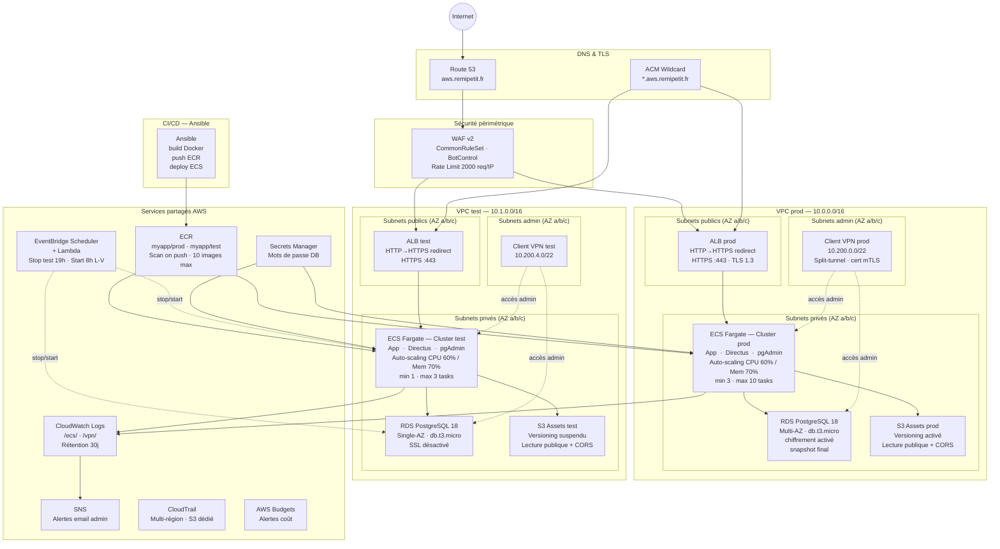

# Architecture AWS — myapp (aws.remipetit.fr)

> Région : **eu-west-3 (Paris)** · Deux environnements : **prod** et **test**  
> Infrastructure as Code : **Terraform** · Déploiements : **Ansible**

---

## Vue d'ensemble



---

## Détail des composants

### Réseau (VPC)

| Tier | CIDR (prod) | CIDR (test) | Contenu |
|------|------------|-------------|---------|
| Public | `10.0.0.x/20` | `10.1.0.x/20` | ALB |
| Privé | `10.0.3.x/20` | `10.1.3.x/20` | ECS Fargate, RDS |
| Admin | `10.0.6.x/20` | `10.1.6.x/20` | Client VPN |

Chaque VPC s'étend sur **3 zones de disponibilité** (eu-west-3a/b/c).

---

### Ingress & Sécurité

```
Internet
  └─▶ Route 53 (A alias → ALB)
        └─▶ WAF v2
              ├─ AWS Managed Rules — CommonRuleSet
              ├─ Bot Control
              └─ Rate Limit 2 000 req/IP/5 min
                    └─▶ ALB (port 80 → redirect 443, port 443 TLS 1.3)
                          └─▶ ECS Fargate (port 80, réseau awsvpc)
```

**Security Groups :**
- `alb-sg` → inbound 80/443 depuis `0.0.0.0/0`
- `ecs-sg` → inbound 80 depuis `alb-sg` uniquement
- `rds-sg` → inbound 5432 depuis `ecs-sg` uniquement

**NACL** : règles d'entrée/sortie supplémentaires par environnement.

---

### Applications ECS Fargate

| Service | Domaine (prod) | Domaine (test) | Port container |
|---------|---------------|---------------|----------------|
| **App principale** | `app.aws.remipetit.fr` | `test.aws.remipetit.fr` | 80 |
| **Directus CMS** | `directus-app.aws.remipetit.fr` | `directus-test.aws.remipetit.fr` | 80 |
| **pgAdmin** | via ALB (priorité 100) | via ALB (priorité 101) | 80 |

**App principale — capacité :**

| | prod | test |
|--|------|------|
| CPU | 512 vCPU units | 256 vCPU units |
| Mémoire | 1 024 MB | 512 MB |
| desired | 3 | 1 |
| min / max | 3 / 10 | 1 / 3 |
| Scale-out CPU | > 60 % | > 60 % |
| Scale-out Mém. | > 70 % | > 70 % |

---

### Base de données — RDS PostgreSQL 18

| | prod | test |
|-|------|------|
| Multi-AZ | ✅ | ❌ |
| Backup retention | 1 jour | 1 jour |
| Deletion protection | ✅ | ❌ |
| Final snapshot | ✅ | ❌ |
| SSL forcé | ✅ | ❌ |
| Chiffrement | ✅ | ✅ |

Mot de passe généré aléatoirement (32 chars) et stocké dans **Secrets Manager**.

---

### ECR — Container Registry

- 1 dépôt par environnement : `myapp/prod`, `myapp/test`
- Scan des images à chaque push (`scan_on_push = true`)
- Lifecycle policy : conservation des **10 dernières images**
- Images gérées par **Ansible** (build → push → deploy ECS)

---

### S3

| Bucket | Usage | Versioning |
|--------|-------|-----------|
| `myapp-prod-assets-<account_id>` | Fichiers Directus (uploads) | Activé |
| `myapp-test-assets-<account_id>` | Fichiers Directus (uploads) | Suspendu |
| `myapp-cloudtrail-logs-<suffix>` | Logs CloudTrail | N/A |

Buckets assets : **lecture publique**, CORS configuré vers le domaine Directus.

---

### Observabilité

```
ECS / ALB / VPN
  └─▶ CloudWatch Logs (rétention 30 j pour ECS, 90 j pour VPN)
        └─▶ CloudWatch Alarms
              ├─ CPU ECS > 80 %
              ├─ Erreurs 5xx ALB > 10 / min
              └─ Latence ALB > seuil
                    └─▶ SNS Topic → email admin (remi.petit@efrei.net)

CloudTrail → S3 (multi-région, validation des logs activée)
```

---

### Scheduler — Économies sur l'env test

```
EventBridge Scheduler
  ├─ 19h00 (L-V) → Lambda stop_test_env
  │     ├─ ECS desired_count = 0 (tous les services)
  │     └─ RDS stop
  │
  └─ 08h00 (L-V) → Lambda start_test_env
        ├─ ECS desired_count = 1
        └─ RDS start
```

---

### Pipeline CI/CD (Ansible)

```
Developer
  └─▶ ansible-playbook deploy.yml
        ├─ Role ecr_push
        │     ├─ docker build
        │     └─ docker push → ECR
        └─ Role ecs_deploy
              └─ aws ecs update-service (force new deployment)
```

Les `task_definition` et `container_definitions` sont marqués `ignore_changes` dans Terraform pour éviter tout conflit avec Ansible.

---

### Accès administrateur (Client VPN)

- Authentification par certificat muTLS (EasyRSA / OpenVPN)
- Split-tunnel activé (seul le trafic VPC transite par le VPN)
- Association aux **subnets admin** — isolés des subnets app et public
- Logs de connexion dans CloudWatch (`/vpn/myapp/<env>`, rétention 90 j)

---

## Flux de données simplifié

```
Utilisateur
  ──HTTPS──▶ Route 53
               ──▶ WAF v2
                    ──▶ ALB (TLS termination)
                         ──▶ ECS Fargate Container (:80)
                               ├──▶ RDS PostgreSQL (subnets privés)
                               └──▶ S3 Assets (lecture/écriture)

Admin
  ──VPN──▶ Subnets admin
              ├──▶ ECS (debug)
              └──▶ pgAdmin / RDS (port 5432)
```
