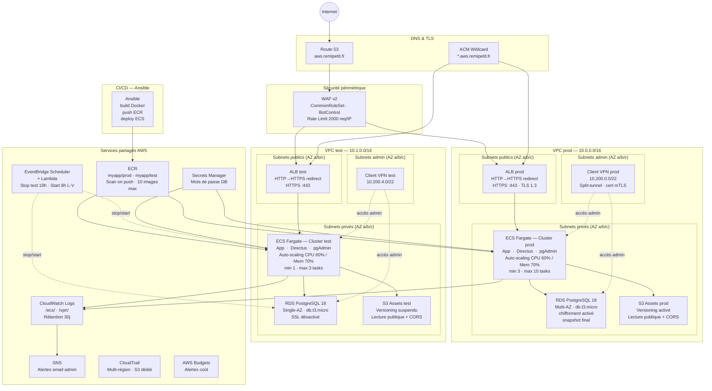

# Architecture AWS — myapp (aws.remipetit.fr)

> Région : **eu-west-3 (Paris)** · Deux environnements : **prod** et **test**  
> Infrastructure as Code : **Terraform** · Déploiements : **Ansible**

---

## Vue d'ensemble

# AWS
https://us-east-1.console.aws.amazon.com/console/home?region=us-east-1

# Test
https://directus-test.aws.remipetit.fr
https://test.aws.remipetit.fr/pgadmin
https://directus-test.aws.remipetit.fr/items/products
https://directus-test.aws.remipetit.fr/server/health

# Prod
https://directus-app.aws.remipetit.fr
https://app.aws.remipetit.fr/pgadmin
https://directus-app.aws.remipetit.fr/items/products
https://directus-app.aws.remipetit.fr/server/health

aws secretsmanager get-secret-value --secret-id myapp/test/directus --region eu-west-3 --query "SecretString" --output text 2>&1 | python3 -m json.tool